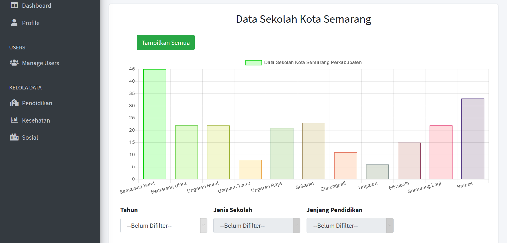
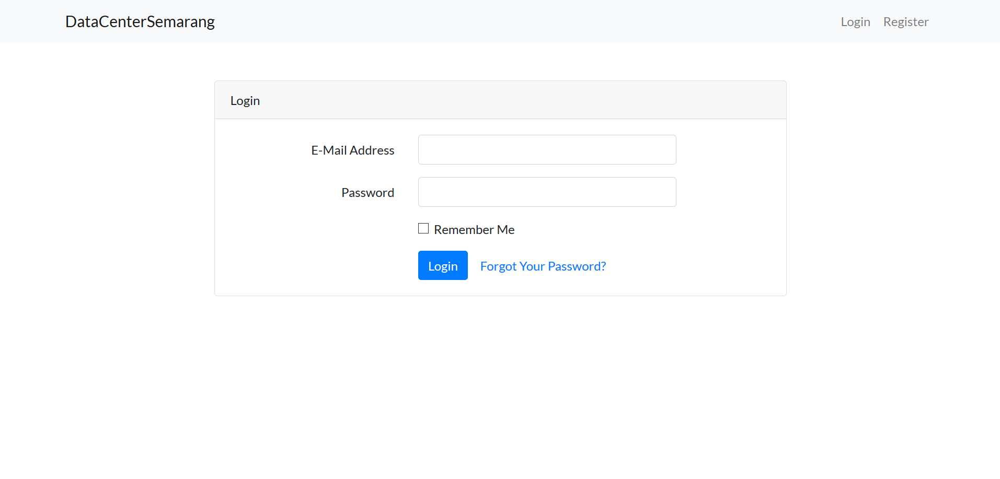
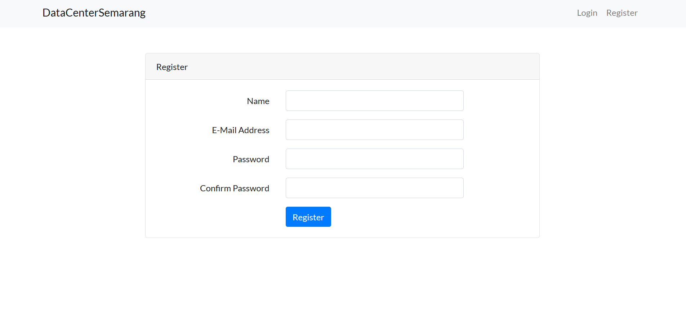
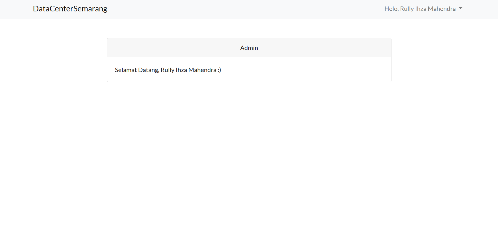

## Tentang Repo

Ini adalah mini-project [laravel](https://laravel.com/ "Web Laravel Official") crud tentang pusat data. Project ini menggunakan bantuan pihak ketiga seperti [Bootstrap 4](https://getbootstrap.com/), [ChartJs](https://www.chartjs.org/), dan [Laravel](https://laravel.com/).

## Fitur yang tersedia

1. Responsif
1. Mengelola dataset
1. Users Management
1. Role Management Users
1. Menyediakan API untuk kebutuhan client side dalam mengelola data
1. Menyediakan grafik menggunakan [chartjs](https://www.chartjs.org/).
1. Profile Management.

## Demo Tampilan

### Laravel

Laravel merupakan sebuah framework php open-source yang accessible, powerful, dan menyediakan tools yang dibutuhkan dalam project skala besar.

### Belajar Laravel

Laravel memiliki dokumentasi yang baik dan friendly yang bisa dipelajari baik beginner maupun advanced. Website resminya, disini => [documentation](https://laravel.com/docs). Laravel juga memiliki video tutorial dengan pendekatan yang modern. Seperti [Laracasts](https://laracasts.com). Laracasts mengandung lebih dari 1500 video tutorial dengan berbagai topik modern, seperti PHP Modern Style, unit testing, Javascript, dan Laravel itu sendiri.

### Thanks.